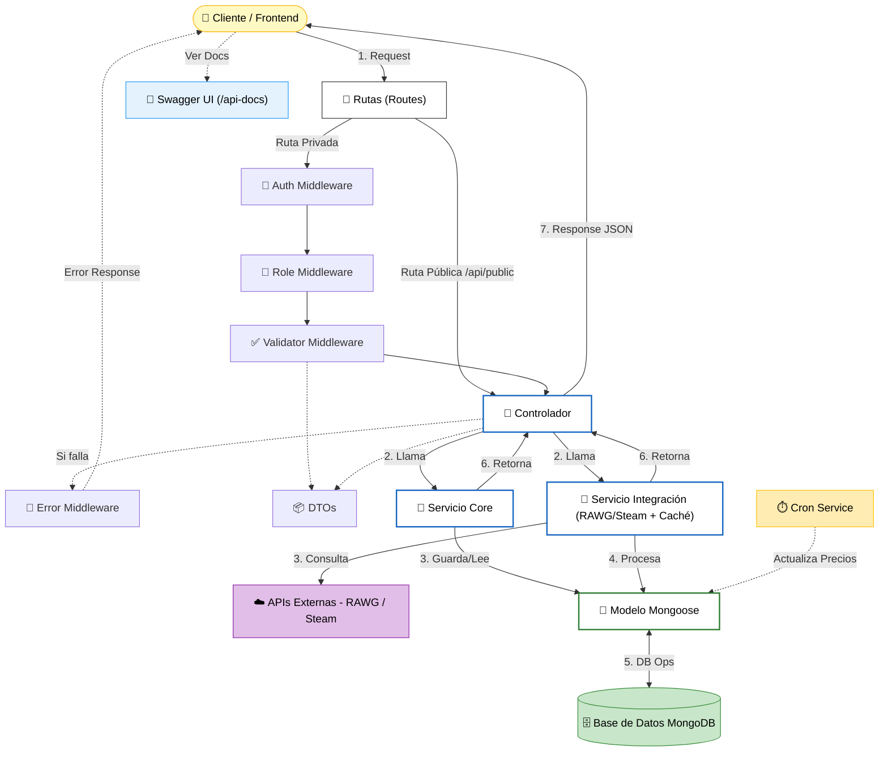

# Arquitectura del Proyecto (MVC + Capas)

Este documento explica en profundidad cómo está construido el backend, **por qué** se tomaron ciertas decisiones y cómo fluyen los datos a través del sistema.

## 🏛️ Filosofía: Arquitectura por Capas (Layered Architecture)

En lugar de escribir todo el código en un solo archivo, dividimos el proyecto en "capas" lógicas. Cada capa tiene una **responsabilidad única**. Esto hace que el código sea fácil de leer, probar y escalar.

### ¿Por qué hacemos esto?

Imagina un restaurante:

- **El Cliente** (Frontend) hace un pedido.
- **El Camarero** (Controlador) toma la nota y se la pasa a la cocina. No cocina el plato.
- **El Cocinero** (Servicio) prepara la comida siguiendo una receta.
- **La Despensa** (Modelo/DB) es donde están los ingredientes.

Si el camarero tuviera que cocinar, cobrar y limpiar, el restaurante sería un caos. En nuestro código pasa lo mismo.

---

## 🧩 Componentes del Sistema

### 1. Configuración (`src/config/`)

Aquí viven las conexiones con el mundo exterior.

- **`db.ts`**: Gestiona la conexión a MongoDB.
- **`env.ts`**: **Importante**. Implementa validación **"Fail-Fast"**. Si falta una variable crítica (`JWT_SECRET`, `MONGO_URI`), la app se niega a arrancar. Esto protege la seguridad en producción.
- **`swagger.ts`**: Configura la documentación automática de la API.

### 2. Modelos (`src/models/`)

Son los "planos" de nuestra base de datos. Usamos **Mongoose** con **Tipado Estricto** (`Types.ObjectId`) para garantizar la integridad de los datos desde el compilador.

- **User**: Define qué es un usuario (`email`, `password`, `role`).
- **Game**: Define qué es un juego (`title`, `score`, `image`).
- **UserGame**: Define la relación usuario-juego (colección). **Cascade Delete**: Si borras al usuario o al juego, esta relación desaparece.
- **Order**: Define una transacción de compra (`totalAmount`, `status`, `games`). **Cascade Delete**: Si borras al usuario, se borran sus órdenes.
- **RefreshToken**: Define el token de seguridad para mantener la sesión. **Cascade Delete**: Si borras al usuario, se revoca el acceso.

### 3. DTOs (`src/dtos/`)

**Data Transfer Objects** (Objetos de Transferencia de Datos).

- Son los "contratos" de entrada.
- Definen estrictamente qué datos aceptamos del exterior.
- _Ejemplo_: "Para registrarse, necesito `email` (string) y `password` (string). Nada más".

### 4. Rutas (`src/routes/`)

Es el mapa de carreteras de la API.

- Dice: "Si alguien va a `POST /api/games`, llama al controlador de juegos".
- Aquí es donde "enchufamos" los middlewares de seguridad.

### 5. Middlewares (`src/middleware/`)

Son los "porteros" y "inspectores". Se ejecutan **antes** de que la petición llegue a su destino.

- **`auth.middleware.ts`**: ¿Tienes un Token válido? Si no, no pasas (401 Unauthorized).
- **`role.middleware.ts`**: ¿Eres Admin? Si no, no tocas esto (403 Forbidden).
- **`validate.middleware.ts`**: ¿Los datos que envías cumplen las reglas? (Ej: el email tiene @).
- **`error.middleware.ts`**: Si algo falla en cualquier punto, este middleware captura el error y responde amablemente al usuario.

### 6. Controladores (`src/controllers/`)

Son los **Camareros**.

- Reciben la petición (`req`).
- Extraen los datos.
- Llaman al Servicio correspondiente.
- Devuelven la respuesta al cliente (`res.json(...)`).
- **Regla de Oro**: Un controlador NO debe tener lógica de negocio (no debe calcular nada, solo coordinar).

### 7. Servicios (`src/services/`)

Son los **Cocineros** (El Cerebro).

- Aquí está la lógica real.
- "Busca este usuario en la BD, comprueba si la contraseña coincide, si sí, genera un token".
- **`PaymentService`**: Gestiona la lógica de compras y creación de órdenes.
- **`FileService`**: Un servicio especial que abstrae el sistema de archivos. Desacopla la lógica de negocio de la infraestructura física (disco duro vs nube).
- **`RAWGService` / `SteamService`**: Servicios de integración que encapsulan la comunicación con APIs externas.
- **`GameAggregatorService`**: Un servicio de alto nivel que orquesta la obtención de datos de múltiples fuentes (RAWG + Steam) para entregar un resultado unificado.

### 8. Automatización y Optimización

Componentes que trabajan en segundo plano para mejorar el rendimiento y la frescura de los datos:

- **`CronService`**: Ejecuta tareas programadas (como la actualización diaria de precios de Steam).
- **`Cache Layer`**: Implementada con `node-cache` dentro de los servicios de integración para evitar llamadas redundantes y respetar los límites de las APIs.

### 9. Utilidades Transversales (`src/utils/`)

Herramientas que usan todas las capas:

- **Logger (Winston)**: Sistema de logs estructurados (JSON, Timestamps, Colores) para observabilidad profesional.
- **AppError**: Clase personalizada de errores para manejar códigos HTTP de forma consistente.

---

## 🔐 Seguridad y Autenticación (Deep Dive)

Hemos implementado un sistema robusto para proteger la aplicación.

### El Problema de la Sesión

HTTP es "stateless" (no tiene memoria). Para que el servidor sepa quién eres en cada petición, usamos **Tokens**.

### Nuestra Solución: Access Token + Refresh Token

1. **Access Token (JWT)**:

   - Es como una pulsera de festival.
   - Contiene tus datos (ID, Rol).
   - **Caduca rápido (15 minutos)**.
   - El servidor lo verifica matemáticamente (no necesita mirar la BD).

2. **Refresh Token**:
   - Es como el ticket de compra de la pulsera.
   - **Dura mucho (7 días)**.
   - Se guarda en la Base de Datos.
   - Sirve para pedir un nuevo Access Token cuando el anterior caduca.

### Estrategia de Rotación (Seguridad Avanzada)

Para evitar que si te roban el Refresh Token puedan usarlo para siempre:

- Cada vez que usas el Refresh Token, **te damos uno nuevo y borramos el viejo**.
- Si alguien intenta usar un Refresh Token viejo (que ya fue usado), el sistema detecta el robo y **bloquea todos los tokens** de ese usuario.

---

## 🔄 Flujo de Datos: "La Vida de una Petición"

Veamos qué pasa exactamente cuando un usuario intenta **Crear un Juego**:

1. **Petición**: El Frontend envía `POST /api/games` con el JSON del juego y el Header `Authorization: Bearer <token>`.
2. **Router**: Recibe la petición y ve que hay middlewares configurados.
3. **Middleware Auth**:
   - Decodifica el Token.
   - ¿Ha caducado? -> Error 401.
   - ¿Es válido? -> Añade `req.userData` y deja pasar.
4. **Middleware Role**:
   - Mira `req.userData.role`.
   - ¿Es 'admin'? -> Pasa.
   - ¿Es 'user'? -> Error 403 (Prohibido).
5. **Middleware Upload** (Si hay imagen):
   - Procesa el archivo subido y lo guarda temporalmente.
6. **Validación**:
   - Compara los datos recibidos con el **DTO** (`CreateGameDto`).
   - ¿Falta el título? ¿El score es texto en vez de número?
   - Si falla -> Error 400.
7. **Controlador (`game.controller.ts`)**:
   - Recibe la petición limpia y segura.
   - Llama a `GameService.create(datos)`.
8. **Servicio (`game.service.ts`)**:
   - Prepara el objeto para Mongoose.
   - Guarda en MongoDB (`Game.create(...)`).
9. **Respuesta**:
   - El Controlador recibe el juego creado.
   - Envía `201 Created` al Frontend.
10. **Manejo de Errores (Si algo falla)**:
    - Si la BD explota o hay un bug, el **Error Middleware** captura la excepción y envía un `500 Internal Server Error` controlado.
11. **Borrado en Cascada (Cascade Delete)**:
    - Cuando un Admin borra un recurso principal (Usuario o Juego), el backend se encarga de limpiar automáticamente todas las referencias huérfanas:
      - Borrar Usuario -> Borra RefeshTokens + UserGames + Orders.
      - Borrar Juego -> Borra UserGames (desaparece de todas las colecciones).

---

## 📊 Diagrama de Arquitectura

