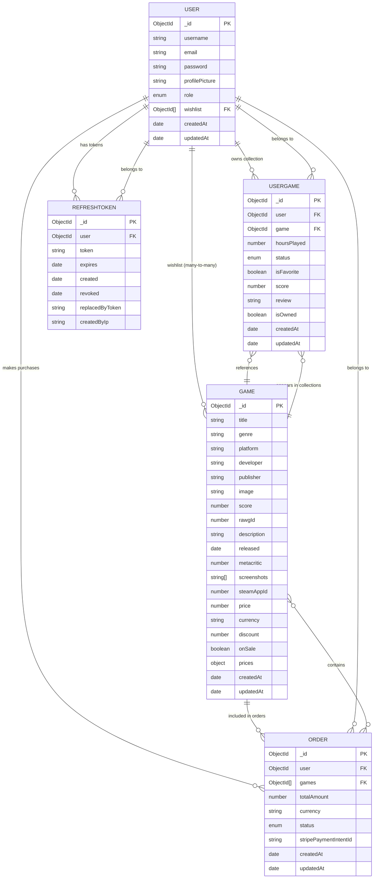
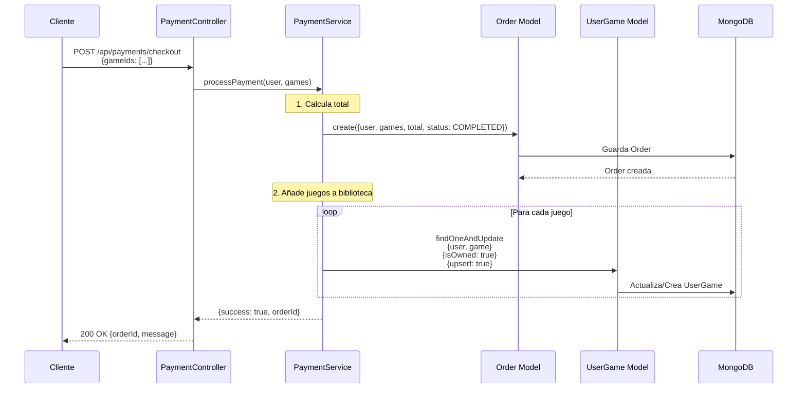
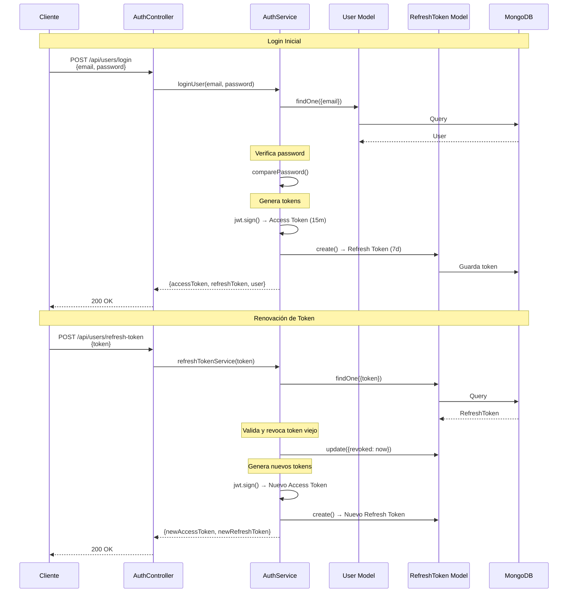

# Arquitectura del Proyecto (MVC + Capas)

Este documento explica en profundidad cómo está construido el backend, **por qué** se tomaron ciertas decisiones y cómo fluyen los datos a través del sistema.

## 🏛️ Filosofía: Arquitectura por Capas (Layered Architecture)

En lugar de escribir todo el código en un solo archivo, dividimos el proyecto en "capas" lógicas. Cada capa tiene una **responsabilidad única**. Esto hace que el código sea fácil de leer, probar y escalar.

### ¿Por qué hacemos esto?

Imagina un restaurante:

- **El Cliente** (Frontend) hace un pedido.
- **El Camarero** (Controlador) toma la nota y se la pasa a la cocina. No cocina el plato.
- **El Cocinero** (Servicio) prepara la comida siguiendo una receta.
- **La Despensa** (Modelo/DB) es donde están los ingredientes.

Si el camarero tuviera que cocinar, cobrar y limpiar, el restaurante sería un caos. En nuestro código pasa lo mismo.

---

## 🧩 Componentes del Sistema

### 1. Configuración (`src/config/`)

Aquí viven las conexiones con el mundo exterior.

- **`db.ts`**: Gestiona la conexión a MongoDB.
- **`env.ts`**: **Importante**. Implementa validación **"Fail-Fast"**. Si falta una variable crítica (`JWT_SECRET`, `MONGO_URI`), la app se niega a arrancar. Esto protege la seguridad en producción.
- **`swagger.ts`**: Configura la documentación automática de la API.

### 2. Modelos (`src/models/`)

Son los "planos" de nuestra base de datos. Usamos **Mongoose** con **Tipado Estricto** (`Types.ObjectId`) para garantizar la integridad de los datos desde el compilador.

- **User**: Define qué es un usuario (`email`, `password`, `role`).
- **Game**: Define qué es un juego (`title`, `score`, `image`).
- **UserGame**: Define la relación usuario-juego (colección). **Cascade Delete**: Si borras al usuario o al juego, esta relación desaparece.
- **Order**: Define una transacción de compra (`totalAmount`, `status`, `games`). **Cascade Delete**: Si borras al usuario, se borran sus órdenes.
- **RefreshToken**: Define el token de seguridad para mantener la sesión. **Cascade Delete**: Si borras al usuario, se revoca el acceso.

### 3. DTOs (`src/dtos/`)

**Data Transfer Objects** (Objetos de Transferencia de Datos).

- Son los "contratos" de entrada.
- Definen estrictamente qué datos aceptamos del exterior.
- _Ejemplo_: "Para registrarse, necesito `email` (string) y `password` (string). Nada más".

### 4. Rutas (`src/routes/`)

Es el mapa de carreteras de la API.

- Dice: "Si alguien va a `POST /api/games`, llama al controlador de juegos".
- Aquí es donde "enchufamos" los middlewares de seguridad.

### 5. Middlewares (`src/middleware/`)

Son los "porteros" y "inspectores". Se ejecutan **antes** de que la petición llegue a su destino.

- **`auth.middleware.ts`**: ¿Tienes un Token válido? Si no, no pasas (401 Unauthorized).
- **`role.middleware.ts`**: ¿Eres Admin? Si no, no tocas esto (403 Forbidden).
- **`validate.middleware.ts`**: ¿Los datos que envías cumplen las reglas? (Ej: el email tiene @).
- **`error.middleware.ts`**: Si algo falla en cualquier punto, este middleware captura el error y responde amablemente al usuario.

### 6. Controladores (`src/controllers/`)

Son los **Camareros**.

- Reciben la petición (`req`).
- Extraen los datos.
- Llaman al Servicio correspondiente.
- Devuelven la respuesta al cliente (`res.json(...)`).
- **Regla de Oro**: Un controlador NO debe tener lógica de negocio (no debe calcular nada, solo coordinar).

### 7. Servicios (`src/services/`)

Son los **Cocineros** (El Cerebro).

- Aquí está la lógica real.
- "Busca este usuario en la BD, comprueba si la contraseña coincide, si sí, genera un token".
- **`PaymentService`**: Gestiona la lógica de compras y creación de órdenes.
- **`FileService`**: Un servicio especial que abstrae el sistema de archivos. Desacopla la lógica de negocio de la infraestructura física (disco duro vs nube).
- **`RAWGService` / `SteamService`**: Servicios de integración que encapsulan la comunicación con APIs externas.
- **`GameAggregatorService`**: Un servicio de alto nivel que orquesta la obtención de datos de múltiples fuentes (RAWG + Steam) para entregar un resultado unificado.

### 8. Automatización y Optimización

Componentes que trabajan en segundo plano para mejorar el rendimiento y la frescura de los datos:

- **`CronService`**: Ejecuta tareas programadas (como la actualización diaria de precios de Steam).
- **`Cache Layer`**: Implementada con `node-cache` dentro de los servicios de integración para evitar llamadas redundantes y respetar los límites de las APIs.

### 9. Utilidades Transversales (`src/utils/`)

Herramientas que usan todas las capas:

- **Logger (Winston)**: Sistema de logs estructurados (JSON, Timestamps, Colores) para observabilidad profesional.
- **AppError**: Clase personalizada de errores para manejar códigos HTTP de forma consistente.

### 10. Estándares de Documentación del Código

El proyecto sigue estrictos estándares de documentación académica definidos en `ai/PROMPT_AI.md`:

#### Principios de Documentación

**Todos los archivos TypeScript incluyen**:

1. **Comentarios de Cabecera** (Inglés):

   ```typescript
   /**
    * @file filename.ts
    * @description Brief explanation of file purpose
    */
   ```

2. **Comentarios de Función** (Inglés):

   ```typescript
   /**
    * Function description
    * @param paramName - Parameter description
    * @returns Return value description
    */
   ```

3. **Comentarios de Destino en Exports** (Inglés):
   ```typescript
   // Destination: Used by ControllerName.methodName (src/path/to/file.ts)
   export const functionName = () => { ... }
   ```

#### Beneficios de Esta Convención

- **Onboarding Rápido**: Cualquier desarrollador puede entender el propósito de un archivo en segundos.
- **Mantenibilidad**: Los comentarios "Destination:" crean un mapa mental de las dependencias.
- **Consistencia**: Estilo académico uniforme en toda la codebase (100% de cumplimiento).
- **Documentación Viva**: Los comentarios se actualizan junto con el código, evitando documentación obsoleta.

#### Ejemplo Completo

```typescript
/**
 * @file auth.service.ts
 * @description Handles all authentication-related business logic.
 */
import { User } from "../models";

/**
 * Registers a new user in the system
 * Destination: Used by AuthController.register (src/controllers/auth.controller.ts)
 * @param userData - User registration data
 * @returns Created user document
 */
export const registerUser = async (userData: RegisterUserDto) => {
  // Hash password before saving
  const hashedPassword = await hashPassword(userData.password);

  const user = new User({
    ...userData,
    password: hashedPassword,
  });

  return await user.save();
};
```

#### Cumplimiento

- **73 archivos TypeScript** revisados
- **100% de cumplimiento** con `PROMPT_AI.md`
- **Verificado** con build y suite completa de tests

## 🔐 Seguridad y Autenticación (Deep Dive)

Hemos implementado un sistema robusto para proteger la aplicación.

### El Problema de la Sesión

HTTP es "stateless" (no tiene memoria). Para que el servidor sepa quién eres en cada petición, usamos **Tokens**.

### Nuestra Solución: Access Token + Refresh Token

1. **Access Token (JWT)**:

   - Es como una pulsera de festival.
   - Contiene tus datos (ID, Rol).
   - **Caduca rápido (15 minutos)**.
   - El servidor lo verifica matemáticamente (no necesita mirar la BD).

2. **Refresh Token**:
   - Es como el ticket de compra de la pulsera.
   - **Dura mucho (7 días)**.
   - Se guarda en la Base de Datos.
   - Sirve para pedir un nuevo Access Token cuando el anterior caduca.

### Estrategia de Rotación (Seguridad Avanzada)

Para evitar que si te roban el Refresh Token puedan usarlo para siempre:

- Cada vez que usas el Refresh Token, **te damos uno nuevo y borramos el viejo**.
- Si alguien intenta usar un Refresh Token viejo (que ya fue usado), el sistema detecta el robo y **bloquea todos los tokens** de ese usuario.

---

## 🔄 Flujo de Datos: "La Vida de una Petición"

Veamos qué pasa exactamente cuando un usuario intenta **Crear un Juego**:

1. **Petición**: El Frontend envía `POST /api/games` con el JSON del juego y el Header `Authorization: Bearer <token>`.
2. **Router**: Recibe la petición y ve que hay middlewares configurados.
3. **Middleware Auth**:
   - Decodifica el Token.
   - ¿Ha caducado? -> Error 401.
   - ¿Es válido? -> Añade `req.userData` y deja pasar.
4. **Middleware Role**:
   - Mira `req.userData.role`.
   - ¿Es 'admin'? -> Pasa.
   - ¿Es 'user'? -> Error 403 (Prohibido).
5. **Middleware Upload** (Si hay imagen):
   - Procesa el archivo subido y lo guarda temporalmente.
6. **Validación**:
   - Compara los datos recibidos con el **DTO** (`CreateGameDto`).
   - ¿Falta el título? ¿El score es texto en vez de número?
   - Si falla -> Error 400.
7. **Controlador (`game.controller.ts`)**:
   - Recibe la petición limpia y segura.
   - Llama a `GameService.create(datos)`.
8. **Servicio (`game.service.ts`)**:
   - Prepara el objeto para Mongoose.
   - Guarda en MongoDB (`Game.create(...)`).
9. **Respuesta**:
   - El Controlador recibe el juego creado.
   - Envía `201 Created` al Frontend.
10. **Manejo de Errores (Si algo falla)**:
    - Si la BD explota o hay un bug, el **Error Middleware** captura la excepción y envía un `500 Internal Server Error` controlado.
11. **Borrado en Cascada (Cascade Delete)**:
    - Cuando un Admin borra un recurso principal (Usuario o Juego), el backend se encarga de limpiar automáticamente todas las referencias huérfanas:
      - Borrar Usuario -> Borra RefeshTokens + UserGames + Orders.
      - Borrar Juego -> Borra UserGames (desaparece de todas las colecciones).

---

## 📊 Diagrama de Arquitectura

```mermaid
flowchart TD
    %% Nodos Externos
    Client([👤 Cliente / Frontend])
    DB[(🗄️ MongoDB)]
    ExternalAPIs[☁️ APIs Externas<br/>RAWG / Steam]
    FileSystem[💾 Sistema de Archivos<br/>uploads/]

    %% Capas del Backend
    Routes["📍 Rutas (Routes)"]
    Docs["📘 Swagger UI<br/>/api-docs"]

    %% Middlewares (Pipeline)
    AuthMW["🔑 Auth Middleware"]
    RoleMW["👮 Role Middleware"]
    UploadMW["📤 Upload Middleware<br/>(Multer)"]
    ValidMW["✅ Validator Middleware"]
    ErrorMW["🚨 Error Middleware"]

    %% Componentes Principales
    Controller["🤵 Controlador<br/>(Auth/Game/Collection/Payment/User)"]
    DTO["📦 DTOs<br/>(Validación de Tipos)"]

    %% Servicios Core
    AuthService["🔐 Auth Service<br/>(Login/Register/Tokens)"]
    GameService["🎮 Game Service<br/>(CRUD Catálogo)"]
    CollectionService["📚 Collection Service<br/>(UserGame CRUD)"]
    PaymentService["💳 Payment Service<br/>(Mock Checkout)"]

    %% Servicios de Integración
    IntegrationService["🔌 Integration Services<br/>(RAWG/Steam + Caché)"]
    AggregatorService["🎯 Aggregator Service<br/>(Combina RAWG+Steam)"]

    %% Servicios Auxiliares
    FileService["📁 File Service<br/>(Gestión Archivos)"]
    CronService["⏱️ Cron Service<br/>(Actualización Precios)"]

    %% Modelos (Base de Datos)
    UserModel["👤 User Model"]
    GameModel["🎮 Game Model"]
    UserGameModel["📚 UserGame Model<br/>(Collection)"]
    OrderModel["🧾 Order Model"]
    RefreshTokenModel["🔑 RefreshToken Model"]

    %% Flujo Principal
    Client -->|1. Request| Routes
    Client -.->|Ver Docs| Docs

    %% Bifurcación: Pública vs Privada
    Routes -->|Ruta Privada| AuthMW
    Routes -->|Ruta Pública<br/>/api/public| Controller

    %% Pipeline de Middlewares (Orden Secuencial)
    AuthMW --> RoleMW
    RoleMW --> UploadMW
    UploadMW --> ValidMW
    ValidMW --> Controller

    %% Validaciones con DTOs
    ValidMW -.->|Valida contra| DTO
    Controller -.->|Usa| DTO

    %% Controlador llama a Servicios
    Controller -->|2. Llama| AuthService
    Controller -->|2. Llama| GameService
    Controller -->|2. Llama| CollectionService
    Controller -->|2. Llama| PaymentService

    %% Servicios Core interactúan con Modelos
    AuthService -->|CRUD| UserModel
    AuthService -->|Gestiona| RefreshTokenModel
    AuthService -.->|Cascade Delete| UserGameModel
    AuthService -.->|Cascade Delete| OrderModel

    GameService -->|CRUD| GameModel
    GameService -.->|Cascade Delete| UserGameModel

    CollectionService -->|CRUD| UserGameModel
    CollectionService -->|Lee| GameModel

    PaymentService -->|Crea| OrderModel
    PaymentService -->|Actualiza| UserGameModel

    %% Servicios usan FileService
    AuthService -.->|Borra imágenes| FileService
    FileService -->|Operaciones| FileSystem

    %% Servicios de Integración
    Controller -->|2. Llama| AggregatorService
    AggregatorService -->|Consulta| IntegrationService
    IntegrationService -->|API Calls| ExternalAPIs
    AggregatorService -->|Guarda| GameModel

    %% Cron Service (Automatización)
    CronService -.->|Actualiza Precios<br/>Diariamente 03:00| GameModel

    %% Modelos persisten en DB
    UserModel <-->|5. DB Ops| DB
    GameModel <-->|5. DB Ops| DB
    UserGameModel <-->|5. DB Ops| DB
    OrderModel <-->|5. DB Ops| DB
    RefreshTokenModel <-->|5. DB Ops| DB

    %% Retorno al Cliente
    AuthService -->|6. Retorna| Controller
    GameService -->|6. Retorna| Controller
    CollectionService -->|6. Retorna| Controller
    PaymentService -->|6. Retorna| Controller
    AggregatorService -->|6. Retorna| Controller

    Controller -->|7. Response JSON| Client

    %% Manejo de Errores (Global)
    Controller -.->|Si falla| ErrorMW
    AuthService -.->|Si falla| ErrorMW
    GameService -.->|Si falla| ErrorMW
    CollectionService -.->|Si falla| ErrorMW
    PaymentService -.->|Si falla| ErrorMW
    ErrorMW -.->|Error Response| Client

    %% Estilos - Externos
    style Client fill:#FFF9C4,stroke:#FBC02D,stroke-width:2px,color:#000
    style DB fill:#C8E6C9,stroke:#388E3C,stroke-width:2px,color:#000
    style ExternalAPIs fill:#E1BEE7,stroke:#8E24AA,stroke-width:2px,color:#000
    style FileSystem fill:#FFE0B2,stroke:#F57C00,stroke-width:2px,color:#000

    %% Estilos - Infraestructura
    style Routes fill:#FFFFFF,stroke:#333,stroke-width:2px,color:#000
    style Docs fill:#E3F2FD,stroke:#2196F3,stroke-width:2px,color:#000

    %% Estilos - Middlewares
    style AuthMW fill:#FFEBEE,stroke:#C62828,stroke-width:2px,color:#000
    style RoleMW fill:#FFEBEE,stroke:#C62828,stroke-width:2px,color:#000
    style UploadMW fill:#F3E5F5,stroke:#6A1B9A,stroke-width:2px,color:#000
    style ValidMW fill:#E8F5E9,stroke:#2E7D32,stroke-width:2px,color:#000
    style ErrorMW fill:#FFCDD2,stroke:#D32F2F,stroke-width:2px,color:#000

    %% Estilos - Controlador y DTOs
    style Controller fill:#E3F2FD,stroke:#1565C0,stroke-width:3px,color:#000
    style DTO fill:#FFF9C4,stroke:#F9A825,stroke-width:2px,color:#000

    %% Estilos - Servicios Core
    style AuthService fill:#E1F5FE,stroke:#0277BD,stroke-width:2px,color:#000
    style GameService fill:#E1F5FE,stroke:#0277BD,stroke-width:2px,color:#000
    style CollectionService fill:#E1F5FE,stroke:#0277BD,stroke-width:2px,color:#000
    style PaymentService fill:#E1F5FE,stroke:#0277BD,stroke-width:2px,color:#000

    %% Estilos - Servicios de Integración
    style IntegrationService fill:#F3E5F5,stroke:#7B1FA2,stroke-width:2px,color:#000
    style AggregatorService fill:#F3E5F5,stroke:#7B1FA2,stroke-width:2px,color:#000

    %% Estilos - Servicios Auxiliares
    style FileService fill:#FFF3E0,stroke:#EF6C00,stroke-width:2px,color:#000
    style CronService fill:#FFECB3,stroke:#FFA000,stroke-width:2px,color:#000

    %% Estilos - Modelos
    style UserModel fill:#E8F5E9,stroke:#2E7D32,stroke-width:2px,color:#000
    style GameModel fill:#E8F5E9,stroke:#2E7D32,stroke-width:2px,color:#000
    style UserGameModel fill:#E8F5E9,stroke:#2E7D32,stroke-width:2px,color:#000
    style OrderModel fill:#E8F5E9,stroke:#2E7D32,stroke-width:2px,color:#000
    style RefreshTokenModel fill:#E8F5E9,stroke:#2E7D32,stroke-width:2px,color:#000
```



### 🔍 Leyenda del Diagrama

**Tipos de Conexiones:**

- **Línea sólida (→)**: Flujo principal de datos/llamadas
- **Línea punteada (-.-→)**: Flujo secundario, opcional o de soporte
- **Línea bidireccional (↔)**: Comunicación bidireccional (ej: DB operations)

- 🟡 **Amarillo**: Cliente y DTOs
- 🟢 **Verde**: Base de Datos y Modelos
- 🔵 **Azul**: Controladores y Servicios Core
- 🟣 **Morado**: Servicios de Integración Externa
- 🔴 **Rojo**: Middlewares de Autenticación/Autorización
- 🟠 **Naranja**: Servicios Auxiliares y Sistema de Archivos

**Características Importantes:**

- ✅ **Cascade Delete**: Representado con líneas punteadas desde AuthService y GameService
- ✅ **Pipeline de Middlewares**: Muestra el orden secuencial (Auth → Role → Upload → Validator)
- ✅ **Separación de Servicios**: Cada servicio core tiene su responsabilidad clara
- ✅ **5 Modelos Específicos**: User, Game, UserGame, Order, RefreshToken
- ✅ **FileService**: Gestión desacoplada del sistema de archivos

---

## 📊 Diagrama Detallado de Relaciones entre Modelos

**Este diagrama muestra en profundidad las relaciones entre los modelos de datos y los flujos de Cascade Delete.**



### 🔗 Explicación de Relaciones

#### **User (Usuario)**

- **1:N con UserGame**: Un usuario puede tener múltiples juegos en su colección
- **1:N con Order**: Un usuario puede realizar múltiples compras
- **1:N con RefreshToken**: Un usuario puede tener múltiples tokens activos (diferentes dispositivos)
- **N:M con Game (Wishlist)**: Un usuario puede tener múltiples juegos en su wishlist, y un juego puede estar en múltiples wishlists

#### **Game (Juego del Catálogo)**

- **1:N con UserGame**: Un juego puede estar en las colecciones de múltiples usuarios
- **N:M con Order**: Un juego puede aparecer en múltiples órdenes
- **N:M con User (Wishlist)**: Un juego puede estar en múltiples wishlists

#### **UserGame (Colección Personal)**

- **N:1 con User**: Cada entrada de colección pertenece a un usuario
- **N:1 con Game**: Cada entrada referencia a un juego del catálogo
- **Índice Único**: `(user, game)` - Un usuario no puede tener el mismo juego dos veces

#### **Order (Orden de Compra)**

- **N:1 con User**: Cada orden pertenece a un usuario
- **N:M con Game**: Una orden puede contener múltiples juegos

#### **RefreshToken (Token de Sesión)**

- **N:1 con User**: Cada token pertenece a un usuario
- **Rotación**: Cuando se usa, se revoca y se crea uno nuevo

### ⚠️ Cascade Delete (Borrado en Cascada)

#### **Cuando se borra un Usuario** (`AuthService.deleteUserById`):

```
DELETE User
  ├─→ DELETE all RefreshToken (where user = userId)
  ├─→ DELETE all UserGame (where user = userId)
  └─→ DELETE all Order (where user = userId)
```

**Impacto**: El usuario desaparece completamente del sistema, incluyendo su sesión, colección y historial de compras.

#### **Cuando se borra un Juego** (`GameService.deleteCatalogGame`):

```
DELETE Game
  └─→ DELETE all UserGame (where game = gameId)
```

**Impacto**: El juego desaparece del catálogo y de todas las colecciones de usuarios. Las órdenes históricas mantienen la referencia (para auditoría).

### 🎯 Wishlist (Lista de Deseos)

La Wishlist es un array de referencias (`ObjectId[]`) dentro del modelo User:

```typescript
// En User Model
wishlist: [{ type: Schema.Types.ObjectId, ref: "Game" }];
```

**Operaciones**:

- **Añadir a Wishlist**: `user.wishlist.push(gameId)` + validación de duplicados
- **Eliminar de Wishlist**: `user.wishlist.filter(id => id !== gameId)`
- **Obtener Wishlist**: `User.findById(userId).populate("wishlist")`

**Endpoints**:

- `POST /api/users/wishlist/:gameId` - Añadir juego
- `DELETE /api/users/wishlist/:gameId` - Eliminar juego
- `GET /api/users/wishlist` - Ver wishlist completa

### 📈 Flujo Completo: Compra de Juegos



### 🔐 Flujo de Autenticación con Refresh Token



---

## 🎨 Resumen de Arquitectura

El backend sigue una **Arquitectura en Capas (Layered Architecture)** con:

1. **Capa de Presentación**: Routes + Middlewares + Controllers
2. **Capa de Lógica de Negocio**: Services (Auth, Game, Collection, Payment, File, Integration)
3. **Capa de Datos**: Models (User, Game, UserGame, Order, RefreshToken)
4. **Capa de Persistencia**: MongoDB

**Principios Aplicados**:

- ✅ **Separación de Responsabilidades** (SRP)
- ✅ **Inyección de Dependencias** (Services desacoplados)
- ✅ **Fail-Fast** (Validación estricta de variables de entorno)
- ✅ **Cascade Delete** (Integridad referencial)
- ✅ **Documentación Académica** (100% de archivos comentados)
