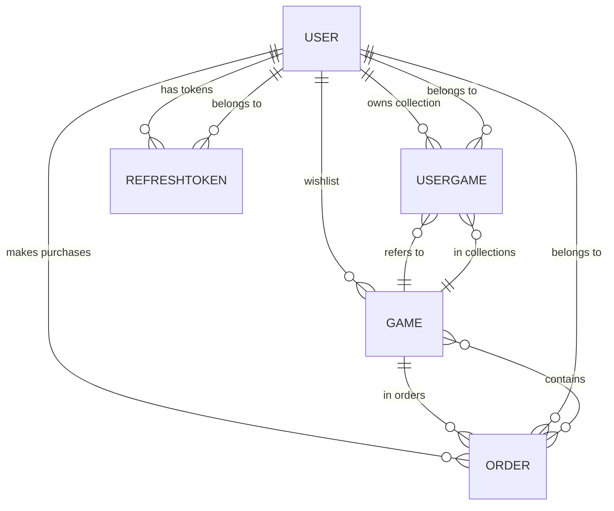
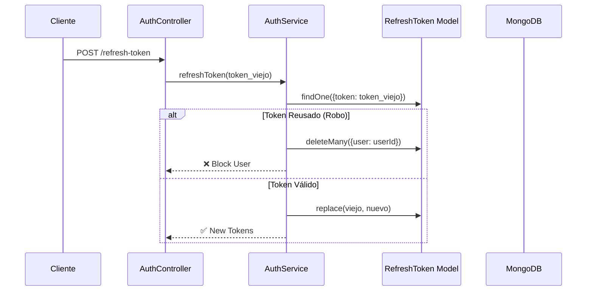
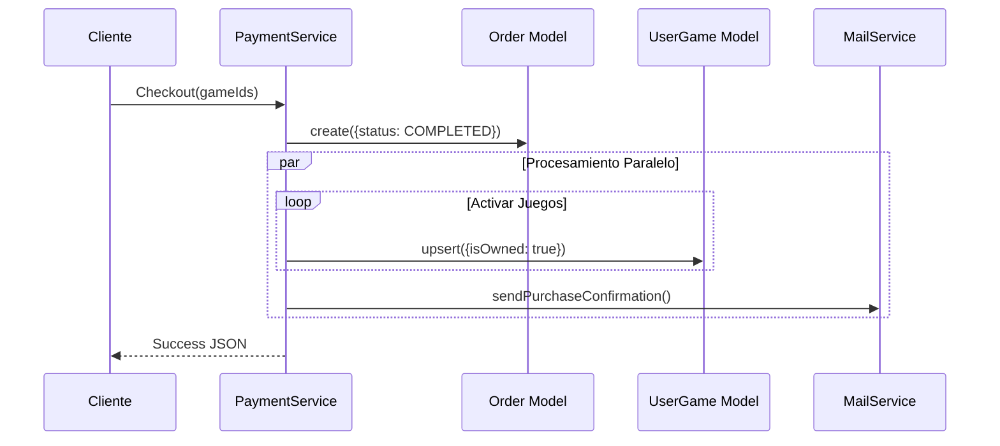
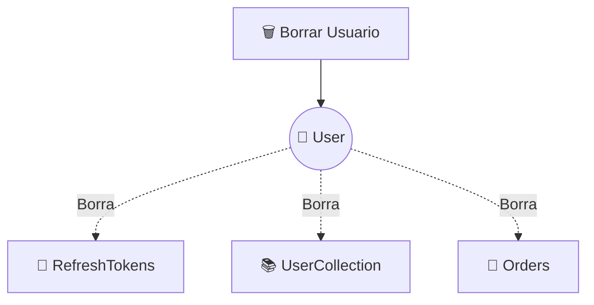

# Arquitectura del Proyecto (MVC + Capas)

Este documento explica en profundidad cómo está construido el backend, **por qué** se tomaron ciertas decisiones y cómo fluyen los datos a través del sistema.

## 🎯 Arquitectura y Patrones de Diseño

Definimos nuestro estilo arquitectónico como **"Layered REST API with Service-Oriented Logic"**.

Esta arquitectura se sostiene sobre **4 Pilares Fundamentales**:

1.  **Layered Architecture**: Separación estricta (Controller -> Service -> Model).
2.  **Service Pattern**: Lógica de negocio pura y reutilizable.
3.  **DTO Pattern**: Validación estricta de entrada.
4.  **Middleware Pipeline**: Gestión de seguridad y errores centralizada.

---

## 📊 Diagrama de Arquitectura (Vista Completa)

Este es el mapa completo del sistema, mostrando cómo interactúan todas las capas, servicios y almacenamiento.

```mermaid
flowchart TD
    %% Nodos Externos
    Client([👤 Cliente / Frontend])
    DB[(🗄️ MongoDB)]
    ExternalAPIs[☁️ APIs Externas<br/>RAWG / Steam]
    FileSystem[💾 Sistema de Archivos<br/>uploads/]

    %% Capas del Backend
    Routes["📍 Rutas (Routes)<br/>/api/games, /public, /orders"]
    Docs["📘 Swagger UI<br/>/api-docs"]

    %% Middlewares (Pipeline)
    AuthMW["🔑 Auth Middleware"]
    RoleMW["👮 Role Middleware"]
    UploadMW["📤 Upload Middleware<br/>(Multer)"]
    ValidMW["✅ Validator Middleware"]
    ErrorMW["🚨 Error Middleware"]

    %% Componentes Principales
    Controller["🤵 Controlador<br/>(Auth/Game/Collection/Payment/User/Order)"]
    DTO["📦 DTOs<br/>(Validación de Tipos)"]

    %% Servicios Core
    AuthService["🔐 Auth Service<br/>(Login/Register/Tokens)"]
    GameService["🎮 Game Service<br/>(CRUD Catálogo)"]
    CollectionService["📚 Collection Service<br/>(UserGame CRUD)"]
    PaymentService["💳 Payment Service<br/>(Mock Checkout)"]

    %% Servicios de Integración
    IntegrationService["🔌 Integration Services<br/>(RAWG/Steam + Caché)"]
    AggregatorService["🎯 Aggregator Service<br/>(Combina RAWG+Steam)"]

    %% Servicios Auxiliares
    FileService["📁 File Service<br/>(Gestión Archivos)"]
    CronService["⏱️ Cron Service<br/>(Actualización Precios)"]
    MailService["📧 Mail Service<br/>(Nodemailer)"]

    %% Modelos (Base de Datos)
    UserModel["👤 User Model"]
    GameModel["🎮 Game Model"]
    UserGameModel["📚 UserGame Model<br/>(Collection)"]
    OrderModel["🧾 Order Model"]
    RefreshTokenModel["🔑 RefreshToken Model"]

    %% Flujo Principal
    Client -->|1. Request| Routes
    Client -.->|Ver Docs| Docs

    %% Bifurcación: Pública vs Privada
    Routes -->|Ruta Privada| AuthMW
    Routes -->|Ruta Pública<br/>/api/public| Controller

    %% Pipeline de Middlewares (Orden Secuencial)
    AuthMW --> RoleMW
    RoleMW --> UploadMW
    UploadMW --> ValidMW
    ValidMW --> Controller

    %% Validaciones con DTOs
    ValidMW -.->|Valida contra| DTO
    Controller -.->|Usa| DTO

    %% Controlador llama a Servicios
    Controller -->|2. Llama| AuthService
    Controller -->|2. Llama| GameService
    Controller -->|2. Llama| CollectionService
    Controller -->|2. Llama| PaymentService

    %% Servicios Core interactúan con Modelos
    AuthService -->|CRUD| UserModel
    AuthService -->|Gestiona| RefreshTokenModel
    AuthService -.->|Cascade Delete| UserGameModel
    AuthService -.->|Cascade Delete| OrderModel

    GameService -->|CRUD| GameModel
    GameService -.->|Cascade Delete| UserGameModel

    CollectionService -->|CRUD| UserGameModel
    CollectionService -->|Lee| GameModel

    PaymentService -->|Crea| OrderModel
    PaymentService -->|Actualiza| UserGameModel
    PaymentService -->|Notifica| MailService

    %% Servicios usan FileService
    AuthService -.->|Borra imágenes| FileService
    FileService -->|Operaciones| FileSystem

    %% Servicios de Integración
    Controller -->|2. Llama| AggregatorService
    AggregatorService -->|Consulta| IntegrationService
    IntegrationService -->|API Calls| ExternalAPIs
    AggregatorService -->|Guarda| GameModel

    %% Cron Service (Automatización)
    CronService -.->|Actualiza Precios<br/>Diariamente 03:00| GameModel

    %% Modelos persisten en DB
    UserModel <-->|5. DB Ops| DB
    GameModel <-->|5. DB Ops| DB
    UserGameModel <-->|5. DB Ops| DB
    OrderModel <-->|5. DB Ops| DB
    RefreshTokenModel <-->|5. DB Ops| DB

    %% Retorno al Cliente
    AuthService -->|6. Retorna| Controller
    GameService -->|6. Retorna| Controller
    CollectionService -->|6. Retorna| Controller
    PaymentService -->|6. Retorna| Controller
    AggregatorService -->|6. Retorna| Controller

    Controller -->|7. Response JSON| Client

    %% Manejo de Errores (Global)
    Controller -.->|Si falla| ErrorMW
    ErrorMW -.->|Error Response| Client

    %% Estilos - Externos
    style Client fill:#FFF9C4,stroke:#FBC02D,stroke-width:2px,color:#000
    style DB fill:#C8E6C9,stroke:#388E3C,stroke-width:2px,color:#000
    style ExternalAPIs fill:#E1BEE7,stroke:#8E24AA,stroke-width:2px,color:#000
    style FileSystem fill:#FFE0B2,stroke:#F57C00,stroke-width:2px,color:#000

    %% Estilos - Infraestructura
    style Routes fill:#FFFFFF,stroke:#333,stroke-width:2px,color:#000
    style Docs fill:#E3F2FD,stroke:#2196F3,stroke-width:2px,color:#000

    %% Estilos - Middlewares
    style AuthMW fill:#FFEBEE,stroke:#C62828,stroke-width:2px,color:#000
    style RoleMW fill:#FFEBEE,stroke:#C62828,stroke-width:2px,color:#000
    style UploadMW fill:#F3E5F5,stroke:#6A1B9A,stroke-width:2px,color:#000
    style ValidMW fill:#E8F5E9,stroke:#2E7D32,stroke-width:2px,color:#000
    style ErrorMW fill:#FFCDD2,stroke:#D32F2F,stroke-width:2px,color:#000

    %% Estilos - Controlador y DTOs
    style Controller fill:#E3F2FD,stroke:#1565C0,stroke-width:3px,color:#000
    style DTO fill:#FFF9C4,stroke:#F9A825,stroke-width:2px,color:#000

    %% Estilos - Servicios Core
    style AuthService fill:#E1F5FE,stroke:#0277BD,stroke-width:2px,color:#000
    style GameService fill:#E1F5FE,stroke:#0277BD,stroke-width:2px,color:#000
    style CollectionService fill:#E1F5FE,stroke:#0277BD,stroke-width:2px,color:#000
    style PaymentService fill:#E1F5FE,stroke:#0277BD,stroke-width:2px,color:#000

    %% Estilos - Servicios de Integración
    style IntegrationService fill:#F3E5F5,stroke:#7B1FA2,stroke-width:2px,color:#000
    style AggregatorService fill:#F3E5F5,stroke:#7B1FA2,stroke-width:2px,color:#000

    %% Estilos - Servicios Auxiliares
    style FileService fill:#FFF3E0,stroke:#EF6C00,stroke-width:2px,color:#000
    style CronService fill:#FFECB3,stroke:#FFA000,stroke-width:2px,color:#000
    style MailService fill:#FFECB3,stroke:#FFA000,stroke-width:2px,color:#000

    %% Estilos - Modelos
    style UserModel fill:#E8F5E9,stroke:#2E7D32,stroke-width:2px,color:#000
    style GameModel fill:#E8F5E9,stroke:#2E7D32,stroke-width:2px,color:#000
    style UserGameModel fill:#E8F5E9,stroke:#2E7D32,stroke-width:2px,color:#000
    style OrderModel fill:#E8F5E9,stroke:#2E7D32,stroke-width:2px,color:#000
    style RefreshTokenModel fill:#E8F5E9,stroke:#2E7D32,stroke-width:2px,color:#000
```



### 🔍 Leyenda del Diagrama

Para facilitar la lectura, hemos codificado los componentes por colores según su **capa de responsabilidad**:

- 🟡 **Amarillo (Cliente/Exteriores)**: Lo que está "fuera" de nuestra app (Usuario, DTOs).
- 🔴 **Rojo/Rosa (Seguridad)**: Middlewares críticos como Auth, Role y Error Handling.
- 🔵 **Azul Intenso (Orquestación)**: Controladores y la documentación Swagger.
- 🟦 **Celeste (Lógica Core)**: Servicios principales donde reside el negocio (`Auth`, `Game`, etc.).
- 🟣 **Morado (Integración)**: Servicios que hablan con APIs externas y Uploads.
- 🟢 **Verde (Datos)**: Modelos de Mongoose y la Base de Datos MongoDB.
- 🟠 **Naranja (Auxiliares)**: Servicios de soporte como Cron y FileService.

---

## 🧩 Componentes del Sistema (Detalle)

### 1. Configuración (`src/config/`)

Gestiona conexiones y entorno. **`env.ts`** implementa "Fail-Fast": si falta una variable crítica, la app explota al inicio (seguridad).

### 2. Modelos (`src/models/`)

Esquemas Mongoose con Tipado Estricto.

- **User**, **Game**, **UserGame**, **Order**, **RefreshToken**.

### 3. Rutas & Controladores (`src/routes/`, `src/controllers/`)

Transforman HTTP Requests en llamadas a Servicios.

- **Regla**: Zero Lógica de Negocio. Solo orquestación.

### 4. Servicios (`src/services/`)

El cerebro de la aplicación.

- **Core**: lógicas CRUD y de negocio (`Auth`, `Game`, `Collection`).
- **Integración**: Wrappers para APIs externas (`RAWG`, `Steam`).
- **Infraestructura**: Abstacciones técnicas (`File`, `Cron`, `Mail`).

---

## 📊 Diagrama de Relaciones (ERD)

Estructura de datos y claves foráneas.



---

## 🔐 Seguridad: Sistema Dual Token (Deep Dive)

1.  **Access Token (15 min)**: JWT firmado. Stateless.
2.  **Refresh Token (7 días)**: Token opaco en DB. Stateful.

**Estrategia de Rotación**:
Cada uso del Refresh Token genera uno nuevo y borra el anterior. Esto permite detectar robos: si alguien intenta usar un token viejo, invalidamos toda la familia de tokens del usuario.

---

## 🔄 Flujo de Datos: "La Vida de una Petición"

Veamos paso a paso qué ocurre cuando creas un juego (`POST /api/games`):

1.  **Petición**: El Frontend envía JSON + Header `Authorization`.
2.  **Middleware Auth**: Verifica validez del Access Token.
3.  **Middleware Role**: Verifica si `user.role === 'admin'`.
4.  **Middleware Validation**: Compara `req.body` contra `CreateGameDto`.
5.  **Controlador**: Recibe datos limpios, llama a `GameService.create()`.
6.  **Servicio**: Aplica reglas de negocio y llama a `GameModel.create()`.
7.  **DB**: Mongoose guarda el documento en MongoDB.
8.  **Respuesta**: Se devuelve `201 Created` al cliente.
9.  **Error Handling**: Si algo falla, `ErrorMiddleware` captura la excepción y normaliza la respuesta JSON.

---

## 🔄 Dynamic Flows: Procesos Críticos

### 1. Autenticación con Rotación



### 2. Compra y Activación



### 3. Cascade Delete (Integridad)



---

---

## 🧪 Estrategia de Testing (Quality Assurance)

Garantizamos la estabilidad del sistema mediante una suite de tests exhaustiva (>85 tests, Jest + Supertest).

### 1. Global Setup (`tests/setup.ts`)

Gestiona el ciclo de vida de la conexión a MongoDB para todos los tests, evitando fugas de memoria y reduciendo boilerplate.

### 2. Tipos de Tests

- **Integración (Routes)**: Verifican el flujo completo desde el Request hasta la DB.
  - _Ejemplo_: `order.integration.test.ts` simula un usuario registrándose, logueándose, creando una orden y verificando su historial.
- **Unitarios (Services)**: Verifican la lógica de negocio aislada.
  - _Ejemplo_: `payment.service.test.ts` valida el cálculo de totales sin necesitar servidor HTTP.
- **Seguridad**: Tests específicos para roles, expiración de tokens, manejo de errores y validación de DTOs.

### 3. Coverage

Cubrimos todos los flujos críticos: Auth, Pagos, Catálogo y Colecciones.

---

## 📝 Estándares de Documentación

Seguimos estándares académicos estrictos (`PROMPT_AI.md`).

**Todos los archivos incluyen**:

1.  **Cabecera de Archivo**:
    ```typescript
    /**
     * @file auth.service.ts
     * @description Handles authentication business logic
     */
    ```
2.  **Comentarios de Función**:
    ```typescript
    /**
     * @param email - User email
     * @returns Auth tokens
     */
    ```
3.  **Comentarios de Destino**:
    ```typescript
    // Destination: Used by AuthController.login
    export const login = ...
    ```

**Cumplimiento**: 100% de la codebase documentada bajo este estándar.
