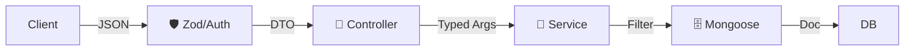

# 🏛️ Log de Arquitectura y Decisiones Técnicas

Este documento rastrea las decisiones arquitectónicas clave que dan forma al proyecto `game-manager-api`.

**Última Revisión**: 14 de Diciembre, 2025

---

## 1. Patrón Arquitectónico: Layered REST

Mantenemos una separación estricta de responsabilidades (SoC).

### 📍 Capa de Transporte (Controllers)

- **Regla**: "Thin Controllers". No contienen lógica.
- **Responsabilidad**: HTTP I/O (Request/Response).
- **Herramienta**: `asyncHandler` para eliminar boilerplate de `try/catch`.

### 🧠 Capa de Negocio (Services)

- **Regla**: "Agnóstico del Transporte". No sabe qué es Express ni HTTP.
- **Responsabilidad**: Reglas de negocio, Validaciones complejas, Integración externa.
- **Novedad (Dic 2025)**: **Strict Typing**.
  - Usamos `mongoose.mongo.Filter<T>` para construir queries. Esto garantiza que el compilador nos alerte si intentamos filtrar por un campo imaginario.

### 🗄️ Capa de Datos (Models)

- **Regla**: "Rich Models".
- **Responsabilidad**: Esquema, Validaciones de DB, Índices.

---

## 2. Stack Tecnológico (Evolución)

- **Runtime**: Node.js + TypeScript (Configurado en modo `strict`).
- **DB**: MongoDB + Mongoose 9.0.
  - _Decisión_: Mongoose 9 introdujo cambios en los tipos. Adaptamos la estrategia usando tipos nativos del driver (`mongoose.mongo`) para mantener la seguridad de tipos.
- **Logger**: Winston.
  - _Decisión_: Reemplazar `console.log` para tener logs JSON estructurados aptos para producción.
- **Validación**: Zod.
  - _Decisión_: Validación "Fail-Fast" en middleware.

---

## 3. Diagrama de Flujo de Datos

---

## 4. Auditoría de Salud

El sistema ha pasado una auditoría completa de "Deuda Técnica".

- **Estado**: Limpio.
- **Pruebas**: 100% Passing.
- **Documentación**: Sincronizada con el código.
